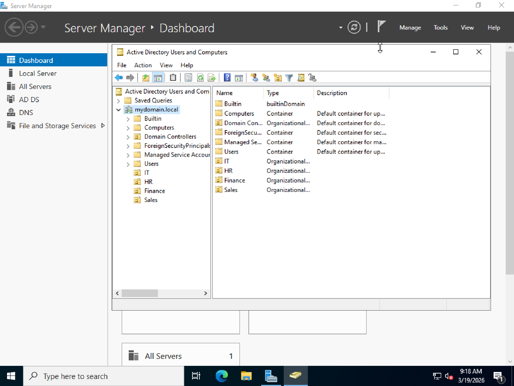
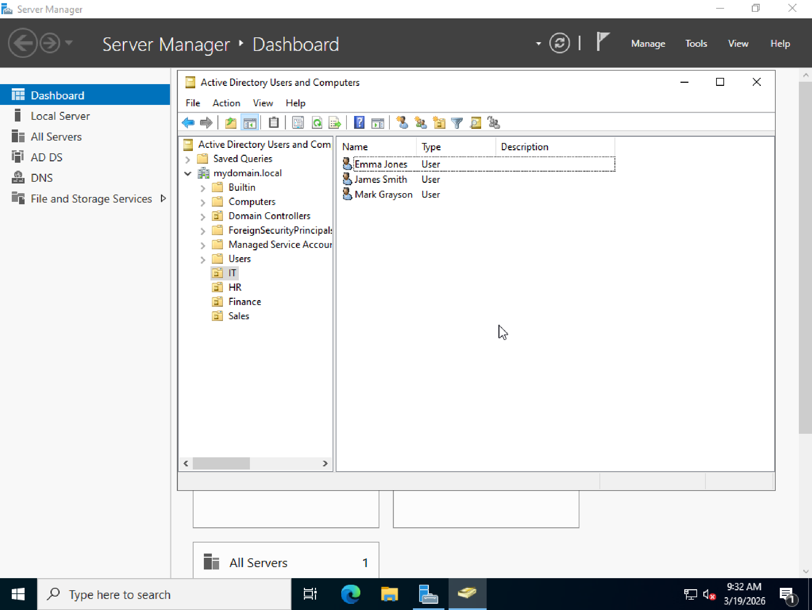
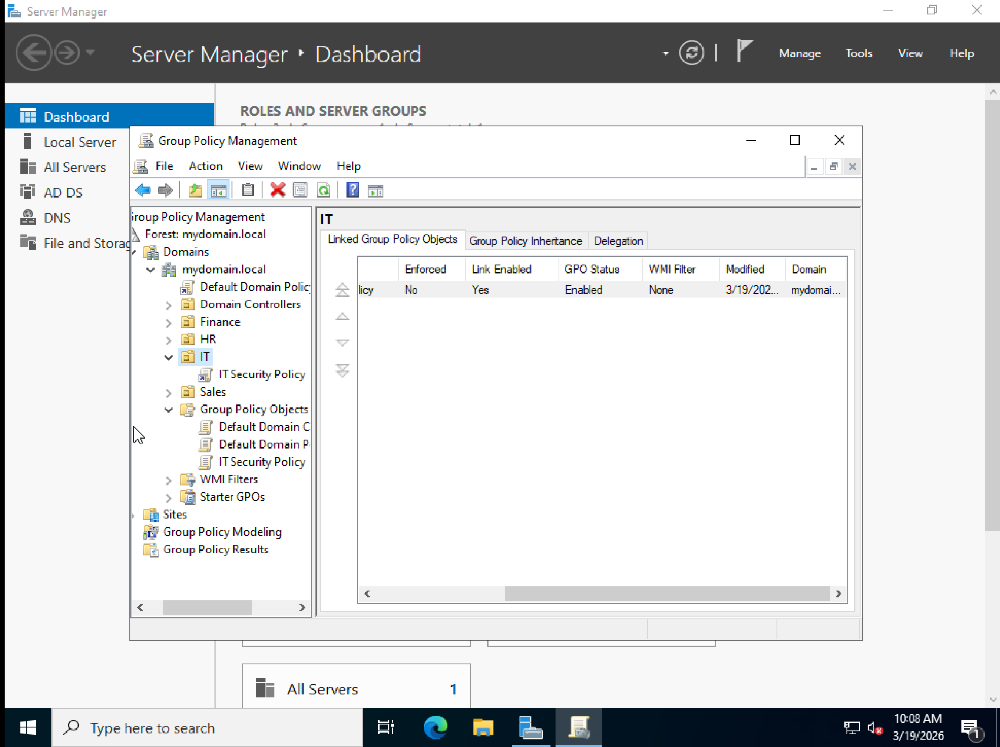
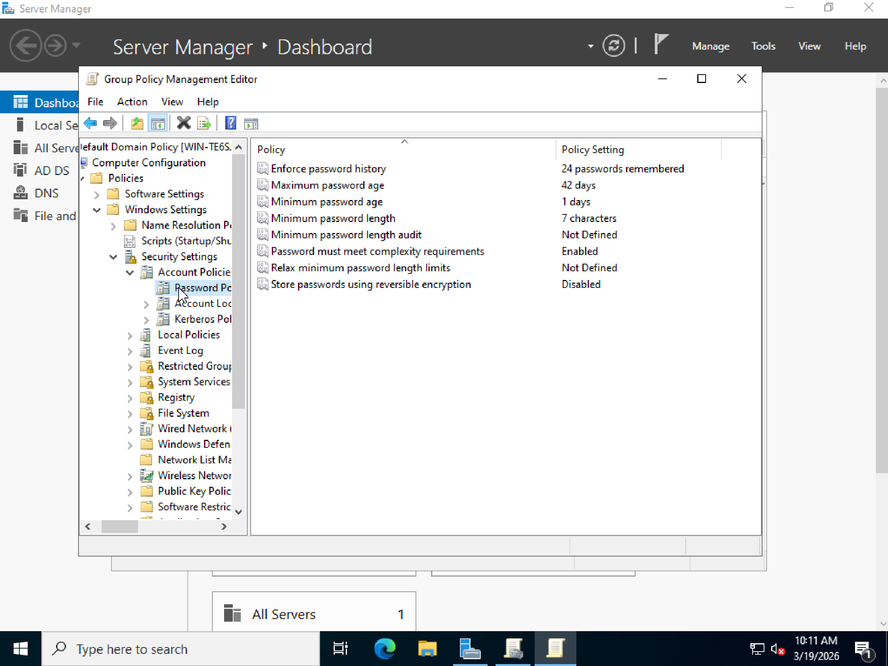
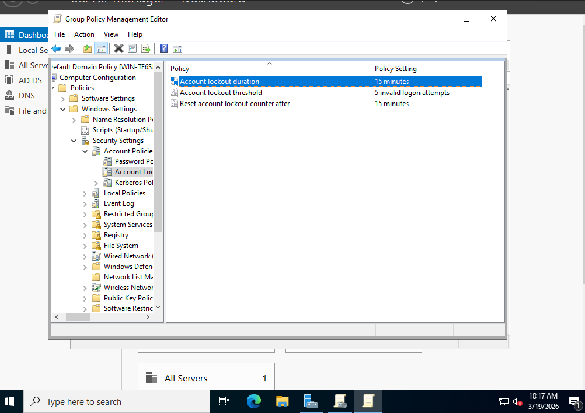
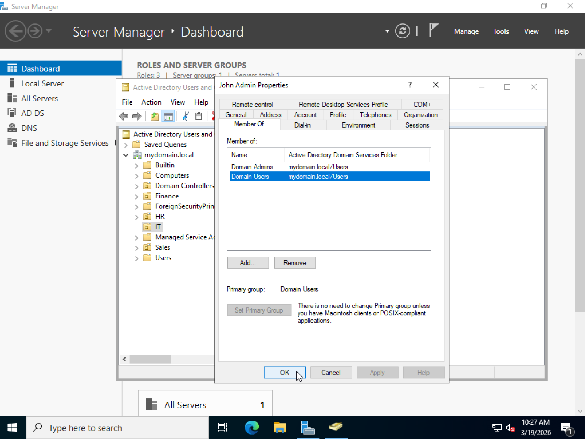

# Active Directory Home Lab

## Overview
This project documents a Windows Server Active Directory home lab built to simulate common enterprise IT administration tasks. The lab focused on identity and access management, Group Policy configuration, and user lifecycle tasks typically performed in help desk and junior system administration roles.

## Environment
- Windows Server
- Active Directory Domain Services (AD DS)
- Active Directory Users and Computers (ADUC)
- Group Policy Management
- Domain: `mydomain.local`

## Project Objectives
- Deploy and configure an Active Directory domain environment
- Create and manage Organizational Units (OUs)
- Provision and manage user accounts
- Create security groups and assign memberships
- Configure Group Policy Objects (GPOs)
- Apply password and account lockout policies
- Assign administrative privileges
- Perform common account management tasks such as password resets and disabling users

## Lab Tasks Completed
- Installed and configured Active Directory Domain Services
- Created Organizational Units for:
  - IT
  - HR
  - Finance
  - Sales
- Created user accounts in the IT OU
- Created the `IT_Admins` security group and added users
- Created a separate administrative account and assigned Domain Admin privileges
- Configured and linked a Group Policy Object named `IT Security Policy`
- Enforced password policy settings
- Configured account lockout policy settings
- Performed password reset and account disable tasks to simulate real-world help desk workflows

## Screenshots

### 1. Active Directory Structure
Shows the domain and Organizational Units created for the lab.

### 2. User Management
Shows multiple user accounts created inside the IT OU.

### 3. GPO Linked to IT OU
Shows the `IT Security Policy` GPO linked to the IT Organizational Unit.

### 4. Password Policy
Shows password policy configuration within Group Policy.

### 5. Account Lockout Policy
Shows account lockout policy settings used to strengthen domain security.

### 6. Admin Privileges
Shows the administrative account assigned to the `Domain Admins` group.

## Skills Demonstrated
- Active Directory administration
- User and group management
- Organizational Unit design
- Group Policy configuration
- Password policy enforcement
- Account lockout configuration
- Privilege assignment and access control
- Basic help desk account management

## Key Takeaway
This lab strengthened my understanding of how Active Directory is used to manage users, permissions, and security policies in a Windows domain environment.
